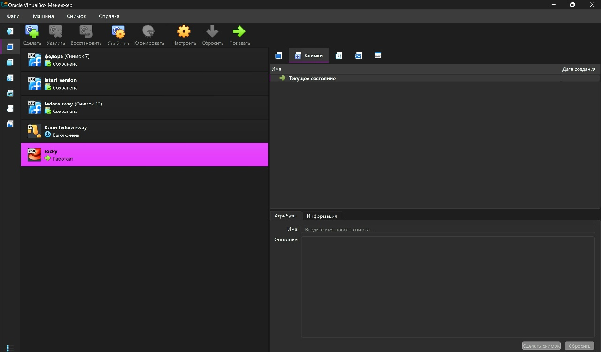
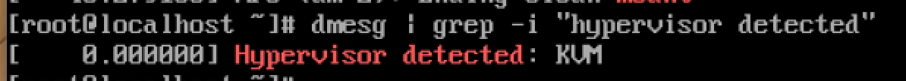
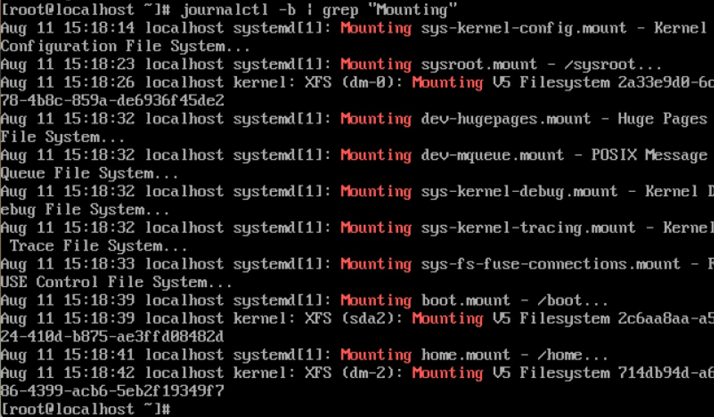

---
## Author
author:
  name: Павлова Татьяна Юрьевна
  degrees: Бакалавр
  orcid:
  email: 1132246745@rudn.ru
  affiliation:
    - name: Российский университет дружбы народов
      country: Российская Федерация
      postal-code:
      city: Москва
      address: ул. Миклухо-Маклая, д. 6
## Title
title: Лабораторная работа №1
subtitle: Установка и конфигурация операционной системы на виртуальную машину
license: CC BY
date: today
date-format: "YYYY-MM-DD" # Example: 2025-09-06
---

# Информация

## Докладчик

:::::::::::::: {.columns align=center}
::: {.column width="70%"}

  * Павлова Татьяна Юрьевна
  * студентка НКАбд-04-24
  * Российский университет дружбы народов им. П. Лумумбы
  * [1132246745@rudn.ru](mailto:1132246745@rudn.ru)
  * <https://github.com/tanuha228/study_2025-2026_infosec-intro>

:::
::::::::::::::

# Цель работы

Целью данной работы является приобретение практических навыков установки операционной системы на виртуальную машину, настройки минимально необходимых для дальнейшей работы сервисов.

# Задание

1) Запуск VirtualBox и создание новой вм (операционная система Linux, Fedora).
2) Настройка установки ОС.
3) Перезапуск вм и установка драйверов для VirtualBox.
4)Подключение образа диска дополнений гостевой ОС.
5)Установка необходимого ПО для создания документации.
6)Выполнение домашнего задания.

# Теоретическое введение

Операционная система - это комплекс взаимосвязанных программ, который действует как интерфейс между приложениями и пользователями с одной стороны и аппаратурой компьютера с другой стороны. VB - это спецаильное средтсво для виртуализации, позволяющее запускать операционную систему внтури другой. С помощью VirtualBox мы можем также настраивать сеть, обмениваться файлами и делать многое другое.

# Выполнение лабораторной работы

##Создание виртуальной машины

1. Создаю новую виртуальную машину в VB, указываю имя, размер основной памяти, размер диска. Добавляем новый исошник и тд. ([рис. @fig-001]).

{#fig-001 width=70%}

##

2. Произвожу установку операционной системы ([рис. @fig-002]), ([рис. @fig-003]), ([рис. @fig-004]).

{#fig-002 width=70%}

##

{#fig-003 width=70%}

##

{#fig-004 width=70%}

##

3. Запуск системы ([рис. @fig-005]).

{#fig-005 width=70%}

# Домашнее задание

3. Смотрю порядок загрузки системы с помощью команды dmesg ([рис. @fig-006]).

{#fig-006 width=70%}

##

4. Получаю информацию о версии ядра, частоте процессора, модели процессора, объеме доступной оперативной памяти, типе обнаруженного гипервизора. Получаю информацию о последовательности монтирования файловых систем ([рис. @fig-007]), ([рис. @fig-008]), ([рис. @fig-009]), ([рис. @fig-010]).

{#fig-007 width=70%}

##

{#fig-008 width=70%}

##

{#fig-009 width=70%}

##

{#fig-010 width=70%}

# Выводы

В результате проделанной лабораторной работы, я приобрела навыки установки операционной системы на вм, а также настройки минимально необходимых для дальнейшей работы сервисов.

:::
