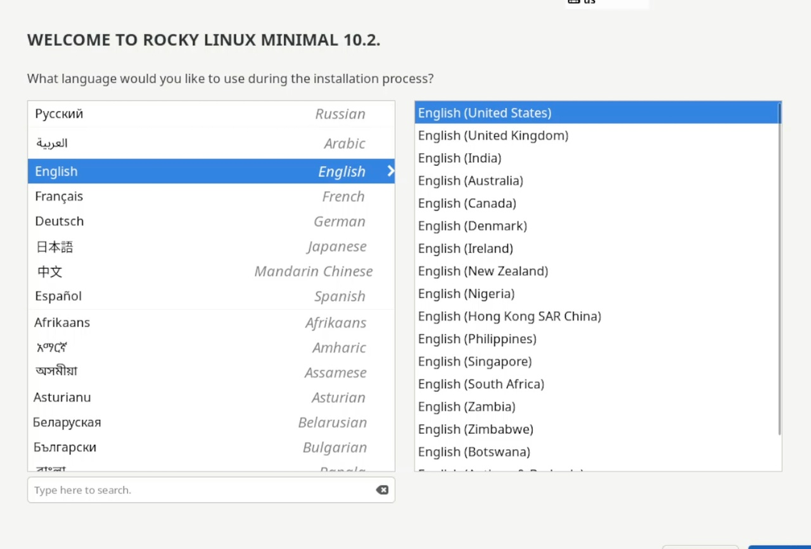
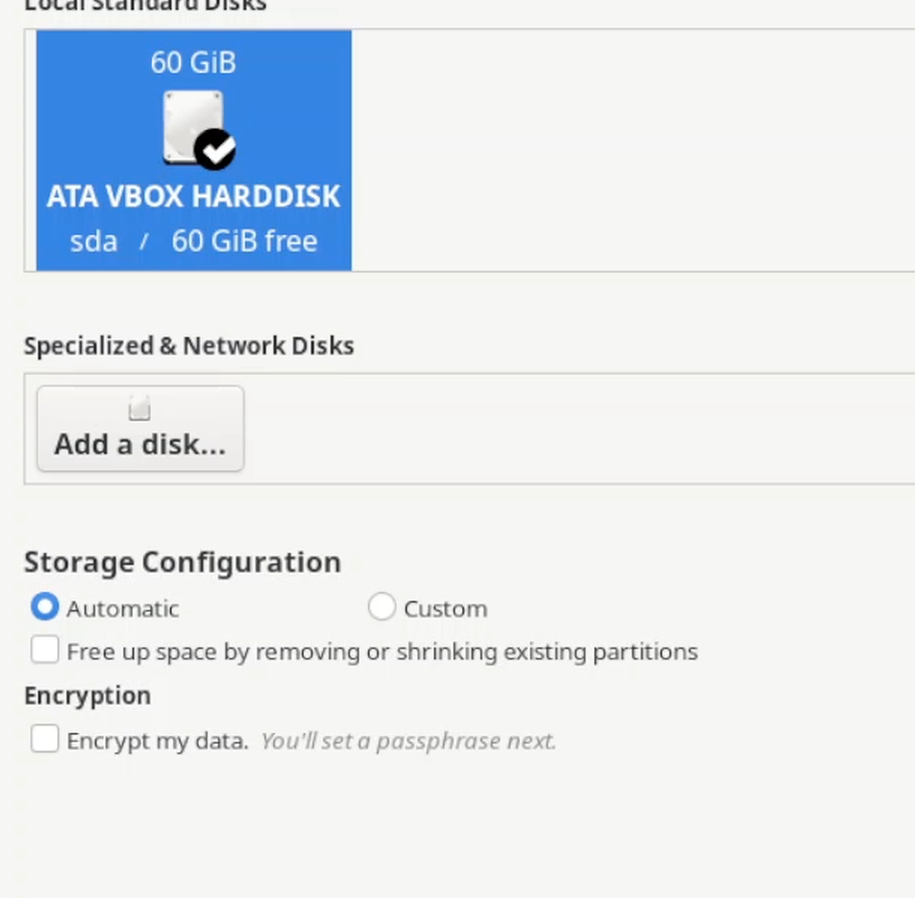
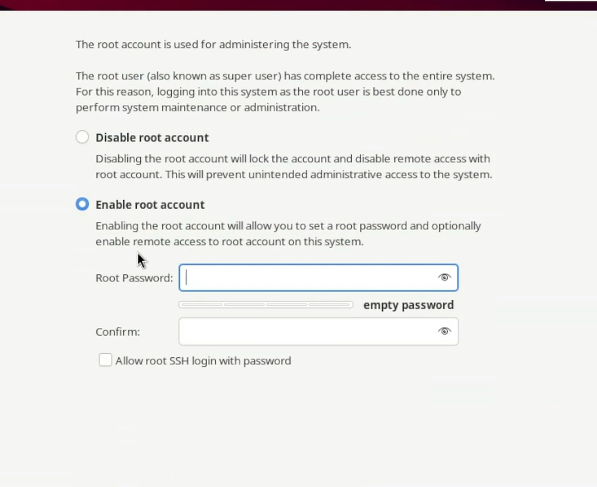
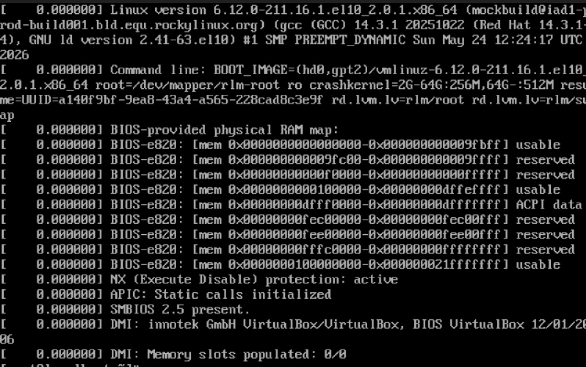
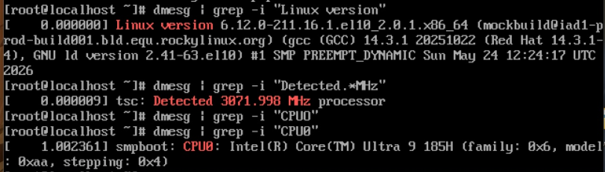
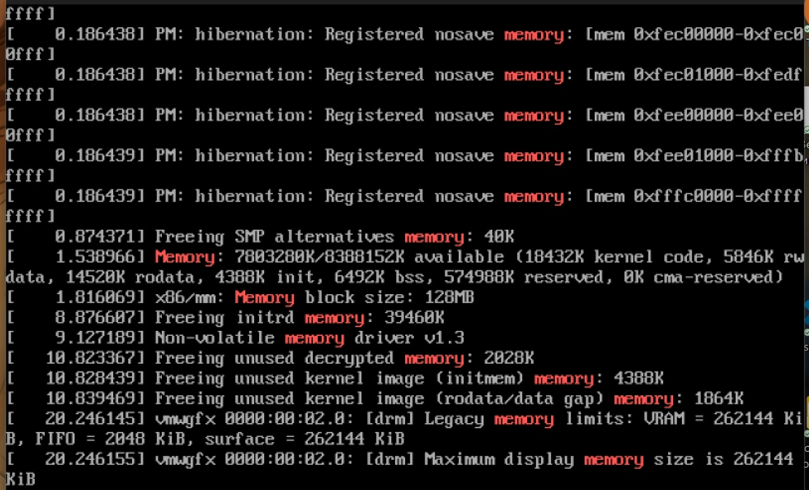
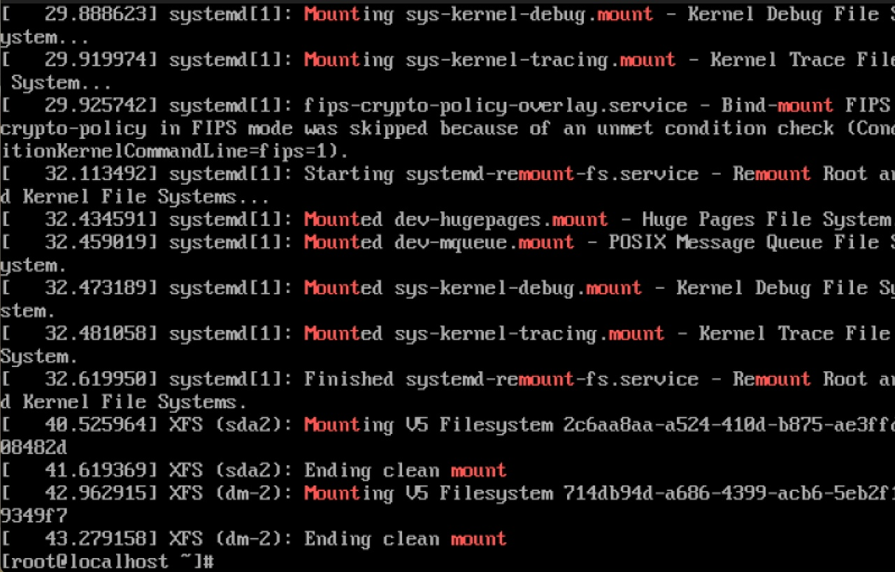

# Лабораторная работа №1
Павлова Татьяна Юрьевна

- [1 Цель работы](#цель-работы)
- [2 Задание](#задание)
- [3 Теоретическое
  введение](#теоретическое-введение)
- [4 Выполнение лабораторной
  работы](#выполнение-лабораторной-работы)
  - [4.1 Создание виртуальной
    машины](#создание-виртуальной-машины)
  - [4.2 Домашнее
    задание](#домашнее-задание)
- [5 Выводы](#выводы)
- [Список литературы](#список-литературы)

# Цель работы

Целью данной работы является приобретение практических навыков установки
операционной системы на виртуальную машину, настройки минимально
необходимых для дальнейшей работы сервисов.

# Задание

1)  Запуск VirtualBox и создание новой вм (операционная система Linux,
    Fedora).
2)  Настройка установки ОС.
3)  Перезапуск вм и установка драйверов для VirtualBox. 4)Подключение
    образа диска дополнений гостевой ОС. 5)Установка необходимого ПО для
    создания документации. 6)Выполнение домашнего задания.

# Теоретическое введение

Операционная система - это комплекс взаимосвязанных программ, который
действует как интерфейс между приложениями и пользователями с одной
стороны и аппаратурой компьютера с другой стороны. VB - это спецаильное
средтсво для виртуализации, позволяющее запускать операционную систему
внтури другой. С помощью VirtualBox мы можем также настраивать сеть,
обмениваться файлами и делать многое другое.

# Выполнение лабораторной работы

## Создание виртуальной машины

1.  Создаю новую виртуальную машину в VB, указываю имя, размер основной
    памяти, размер диска. Добавляем новый исошник и тд.
    (<a href="#fig-001" class="quarto-xref">рис. 1</a>).

Рисунок 1: Меню Virtual Box

2.  Произвожу установку операционной системы
    (<a href="#fig-002" class="quarto-xref">рис. 2</a>),
    (<a href="#fig-003" class="quarto-xref">рис. 3</a>),
    (<a href="#fig-004" class="quarto-xref">рис. 4</a>).

Рисунок 2: Настройка языка

Рисунок 3: Подключение диска

Рисунок 4: Настройка root аккаунта

3.  Запуск системы (<a href="#fig-005" class="quarto-xref">рис. 5</a>).

Рисунок 5: Запуск

## Домашнее задание

3.  Смотрю порядок загрузки системы с помощью команды dmesg
    (<a href="#fig-006" class="quarto-xref">рис. 6</a>).

Рисунок 6: Выполнение команды

4.  Получаю информацию о версии ядра, частоте процессора, модели
    процессора, объеме доступной оперативной памяти, типе обнаруженного
    гипервизора. Получаю информацию о последовательности монтирования
    файловых систем (<a href="#fig-007" class="quarto-xref">рис. 7</a>),
    (<a href="#fig-008" class="quarto-xref">рис. 8</a>),
    (<a href="#fig-009" class="quarto-xref">рис. 9</a>),
    (<a href="#fig-010" class="quarto-xref">рис. 10</a>).

Рисунок 7: Получение информации ч.1

Рисунок 8: Получение информации ч.2

Рисунок 9: Получение информации ч.3

Рисунок 10: Получение информации ч.4

# Выводы

В результате проделанной лабораторной работы, я приобрела навыки
установки операционной системы на вм, а также настройки минимально
необходимых для дальнейшей работы сервисов.

# Список литературы

