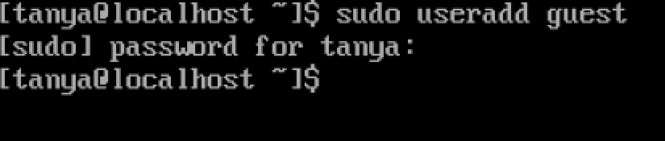
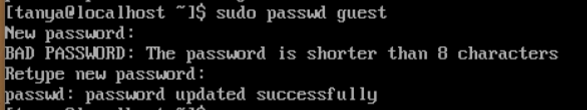
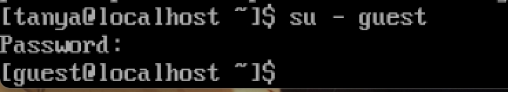
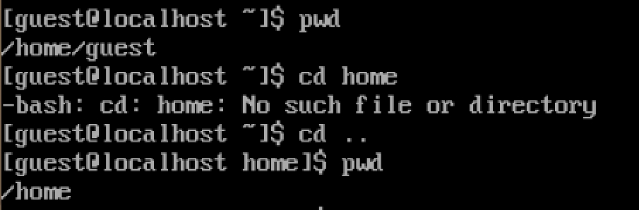
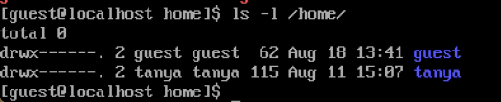
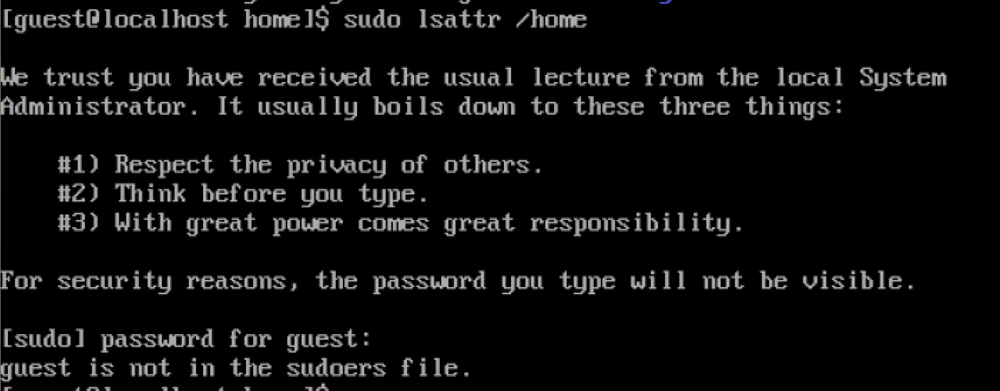

---
## Author
author:
  name: Павлова Татьяна Юрьевна
  degrees: Бакалавр
  orcid:
  email: 1132246745@rudn.ru
  affiliation:
    - name: Российский университет дружбы народов
      country: Российская Федерация
      postal-code:
      city: Москва
      address: ул. Миклухо-Маклая, д. 6
## Title
title: Лабораторная работа №1
subtitle: Установка и конфигурация операционной системы на виртуальную машину
license: CC BY
date: today
date-format: "YYYY-MM-DD" # Example: 2025-09-06
---

# Информация

## Докладчик

:::::::::::::: {.columns align=center}
::: {.column width="70%"}

  * Павлова Татьяна Юрьевна
  * студентка НКАбд-04-24
  * Российский университет дружбы народов им. П. Лумумбы
  * [1132246745@rudn.ru](mailto:1132246745@rudn.ru)
  * <https://github.com/tanuha228/study_2025-2026_infosec-intro>

:::
::::::::::::::

# Элементы презентации

## Цель работы

Получение практических навыков работы в консоли с атрибутами файлов, закрепление теоретических основ дискреционного разграничения доступа в современных системах с открытым кодом на базе ОС Linux. 

## Задание

1. Работа с атрибутами файлов
2. Заполнение таблицы "Установленные права и разрешённые действия" (см. табл. в отчете)
3. Заполнение таблицы "Минимальные права для совершения операций" (см. табл. в отчете)

# Выполнение лабораторной работы

## 1

В операционной системе Rocky создаю нового пользователя guest через учетную запись администратора ([рис. @fig-001]).

{#fig-001 width=70%}

## 2

Далее задаю пароль для созданной учетной записи ([рис. @fig-002]).

{#fig-002 width=70%}

## 3

Сменяю пользователя в системе на только что созданного пользователя guest ([рис. @fig-003]).

{#fig-003 width=70%}

## 4

Определяю с помощью команды pwd, что я нахожусь в директории /home/guest/. Эта директория является домашней, ведь в приглашении командой строкой стоит значок ~, указывающий, что я в домашней директории ([рис. @fig-004]).

{#fig-004 width=70%}

## 5

Далее: 
1. Уточняю имя пользователя 
2. В выводе команды groups информация только о названии группы, к которой относится пользователь. В выводе команды id можно найти больше информации: имя пользователя и имя группы, также коды имени пользователя и группы 
3. Имя пользователя в приглашении командной строкой совпадает с именем пользователя, которое выводит команда whoami
4. Получаю информацию о пользователе с помощью команды 
```
cat /etc/passwd | grep guest
```
5. В выводе получаю коды пользователя и группы, адрес домашней директории 

## 6

Список поддиректорий директории home получилось получить с помощью команды ls -l, если мы добавим опцию -a, то сможем увидеть еще и директорию пользователя root. Права у директории:

root: drwxr-xr-x,

tanya и guest: drwx------([рис. @fig-009]).

{#fig-009 width=70%}

## 7

Пыталась проверить расширенные атрибуты директорий. Нет, их увидеть не удалось. Увидеть расширенные атрибуты других пользователей, тоже не удалось, для них даже вывода списка директорий не было. ([рис. @fig-010]).

{#fig-010 width=70%}

## 8

Создаю поддиректорию dir1 для домашней директории. Расширенные атрибуты командой lsattr просмотреть у директории не удается, но атрибуты есть: drwxr-xr-x, их удалось просмотреть с помощью команды ls -l и снимаю атрибуты командой chmod 000 dir1, при проверке с помощью команды ls -l видно, что теперь атрибуты действительно сняты 

## 9

13. Попытка создать файл в директории dir1. Выдает ошибку: "Отказано в доступе" ([рис. @fig-013]).

{#fig-013 width=70%}

Вернув права директории и использовав снова командy ls -l можно убедиться, что файл не был создан

# Выводы

Были получены практические навыки работы в консоли с атрибутами файлов, закреплены теоретические основы дискреционного разграничения доступа в современных системах с открытым кодом на базе ОС Linux.

:::
