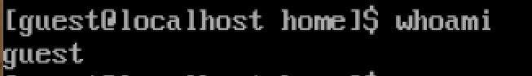
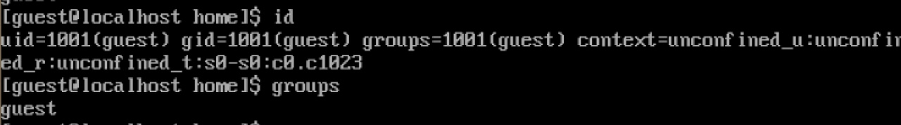
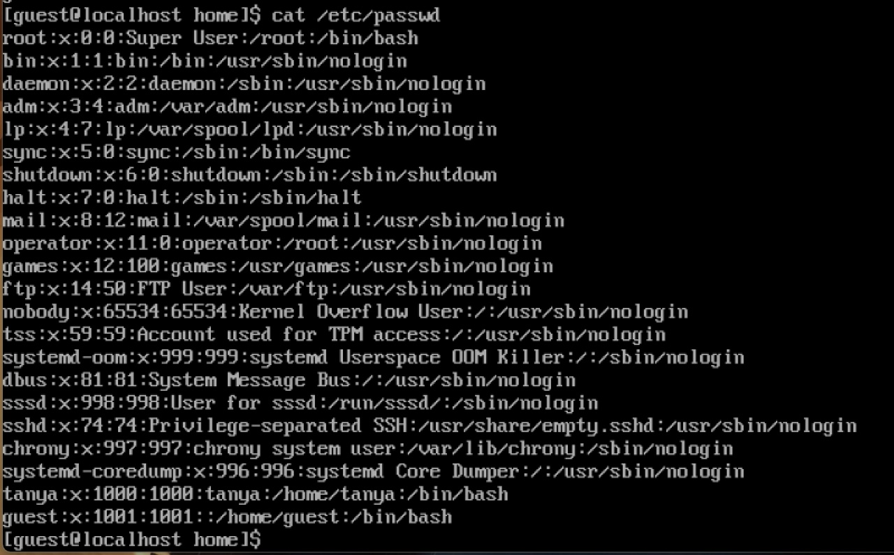
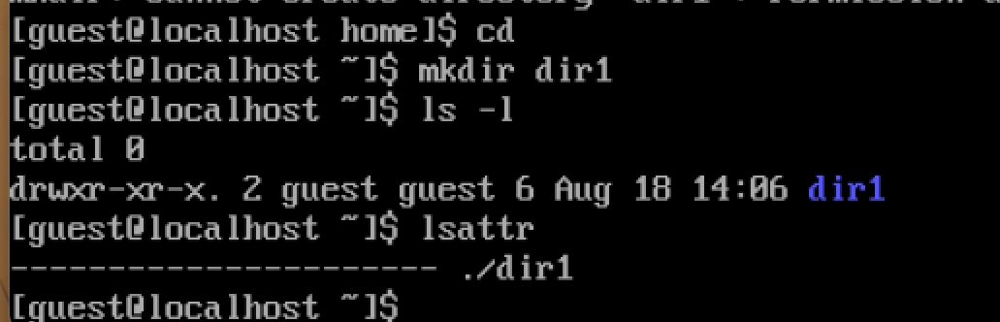
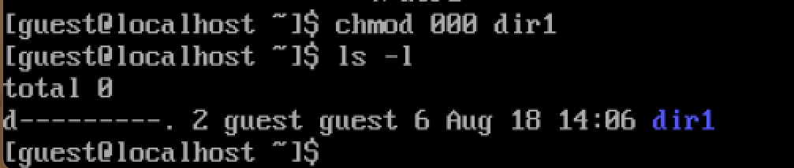
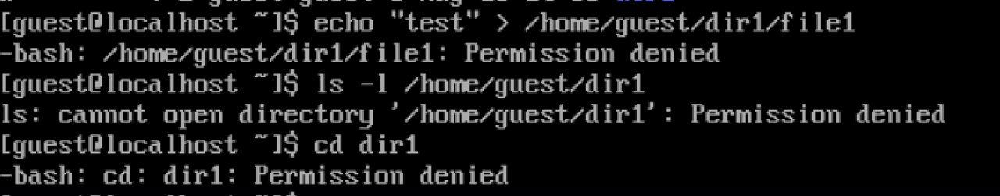

# Лабораторная работа №2
Павлова Татьяна Юрьевна

- [1 Цель работы](#цель-работы)
- [2 Задание](#задание)
- [3 Теоретическое
  введение](#теоретическое-введение)
- [4 Выполнение лабораторной
  работы](#выполнение-лабораторной-работы)
  - [4.1 Заполнение таблицы
    2.1](#заполнение-таблицы-21)
  - [4.2 Заполнение таблицы
    2.2](#заполнение-таблицы-22)
- [5 Выводы](#выводы)
- [Список литературы](#список-литературы)

# Цель работы

Получение практических навыков работы в консоли с атрибутами файлов,
закрепление теоретических основ дискреционного разграничения доступа в
современных системах с открытым кодом на базе ОС Linux.

# Задание

1.  Работа с атрибутами файлов
2.  Заполнение таблицы “Установленные права и разрешённые действия” (см.
    табл. 2.1)
3.  Заполнение таблицы “Минимальные права для совершения операций” (см.
    табл. 2.2)

# Теоретическое введение

**Операционная система** — это комплекс программ, предназначенных для
управления ресурсами компьютера и организации взаимодействия с
пользователем.

**Права доступа** определяют, какие действия конкретный пользователь
может или не может совершать с определенным файлами и каталогами. С
помощью разрешений можно создать надежную среду — такую, в которой никто
не может поменять содержимое ваших документов или повредить системные
файлы.

# Выполнение лабораторной работы

1.  В операционной системе Rocky создаю нового пользователя guest через
    учетную запись администратора
    (<a href="#fig-001" class="quarto-xref">рис. 1</a>).

Рисунок 1: Добавление пользователя

2.  Далее задаю пароль для созданной учетной записи
    (<a href="#fig-002" class="quarto-xref">рис. 2</a>).

Рисунок 2: Добавление пароля для пользователя

3.  Сменяю пользователя в системе на только что созданного пользователя
    guest (<a href="#fig-003" class="quarto-xref">рис. 3</a>).

Рисунок 3: Вход через аккаунт пользователя

4.  Определяю с помощью команды pwd, что я нахожусь в директории
    /home/guest/. Эта директория является домашней, ведь в приглашении
    командой строкой стоит значок ~, указывающий, что я в домашней
    директории (<a href="#fig-004" class="quarto-xref">рис. 4</a>).

Рисунок 4: Текущая директория

5.  Уточняю имя пользователя
    (<a href="#fig-005" class="quarto-xref">рис. 5</a>).

Рисунок 5: Информация об имени пользователе

6.  В выводе команды groups информация только о названии группы, к
    которой относится пользователь. В выводе команды id можно найти
    больше информации: имя пользователя и имя группы, также коды имени
    пользователя и группы
    (<a href="#fig-006" class="quarto-xref">рис. 6</a>).

Рисунок 6: Информация о пользователе

7.  Имя пользователя в приглашении командной строкой совпадает с именем
    пользователя, которое выводит команда whoami
    (<a href="#fig-007" class="quarto-xref">рис. 7</a>).

Рисунок 7: Сравнение информации об имени пользователя

8.  Получаю информацию о пользователе с помощью команды

<!-- -->

    cat /etc/passwd | grep guest

В выводе получаю коды пользователя и группы, адрес домашней директории
(<a href="#fig-008" class="quarto-xref">рис. 8</a>).

Рисунок 8: Просмотр файла passwd

9.  Список поддиректорий директории home получилось получить с помощью
    команды ls -l, если мы добавим опцию -a, то сможем увидеть еще и
    директорию пользователя root. Права у директории:

root: drwxr-xr-x,

tanya и guest:
drwx——(<a href="#fig-009" class="quarto-xref">рис. 9</a>).

Рисунок 9: Просмотр содержимого директории

10. Пыталась проверить расширенные атрибуты директорий. Нет, их увидеть
    не удалось (рис. 10). Увидеть расширенные атрибуты других
    пользователей, тоже не удалось, для них даже вывода списка
    директорий не было.
    (<a href="#fig-010" class="quarto-xref">рис. 10</a>).

Рисунок 10: Проверка расширенных атрибутов

11. Создаю поддиректорию dir1 для домашней директории. Расширенные
    атрибуты командой lsattr просмотреть у директории не удается, но
    атрибуты есть: drwxr-xr-x, их удалось просмотреть с помощью команды
    ls -l (<a href="#fig-011" class="quarto-xref">рис. 11</a>).

Рисунок 11: Создание поддиректории

12. Снимаю атрибуты командой chmod 000 dir1, при проверке с помощью
    команды ls -l видно, что теперь атрибуты действительно сняты
    (<a href="#fig-012" class="quarto-xref">рис. 12</a>).

Рисунок 12: Снятие атрибутов с директории

13. Попытка создать файл в директории dir1. Выдает ошибку: “Отказано в
    доступе” (<a href="#fig-013" class="quarto-xref">рис. 13</a>).

Рисунок 13: Попытка создания файла

Вернув права директории и использовав снова командy ls -l можно
убедиться, что файл не был создан

## Заполнение таблицы 2.1

|  |  |  |  |  |  |  |  |  |  |
|----|----|----|----|----|----|----|----|----|----|
| Права директории | Права файла | Создание файла | Удаление файла | Запись в файл | Чтение файла | Смена директории | Просмотр файлов в директории | Переимено- вание файла | Смена атрибутов файла |
| d(000) | \(000\) | \- | \- | \- | \- | \- | \- | \- | \- |
| d(000) | \(100\) | \- | \- | \- | \- | \- | \- | \- | \- |
| d(000) | \(200\) | \- | \- | \- | \- | \- | \- | \- | \- |
| d(000) | \(300\) | \- | \- | \- | \- | \- | \- | \- | \- |
| d(000) | \(400\) | \- | \- | \- | \- | \- | \- | \- | \- |
| d(000) | \(500\) | \- | \- | \- | \- | \- | \- | \- | \- |
| d(000) | \(600\) | \- | \- | \- | \- | \- | \- | \- | \- |
| d(000) | \(700\) | \- | \- | \- | \- | \- | \- | \- | \- |
| d(100) | \(000\) | \- | \- | \- | \- | \+ | \- | \- | \+ |
| d(100) | \(100\) | \- | \- | \- | \- | \+ | \- | \- | \+ |
| d(100) | \(200\) | \- | \- | \+ | \- | \+ | \- | \- | \+ |
| d(100) | \(300\) | \- | \- | \+ | \- | \+ | \- | \- | \+ |
| d(100) | \(400\) | \- | \- | \- | \+ | \+ | \- | \- | \+ |
| d(100) | \(500\) | \- | \- | \- | \+ | \+ | \- | \- | \+ |
| d(100) | \(600\) | \- | \- | \+ | \+ | \+ | \- | \- | \+ |
| d(100) | \(700\) | \- | \- | \+ | \+ | \+ | \- | \- | \+ |
| d(200) | \(000\) | \- | \- | \- | \- | \- | \- | \- | \- |
| d(200) | \(100\) | \- | \- | \- | \- | \- | \- | \- | \- |
| d(200) | \(200\) | \- | \- | \- | \- | \- | \- | \- | \- |
| d(200) | \(300\) | \- | \- | \- | \- | \- | \- | \- | \- |
| d(200) | \(400\) | \- | \- | \- | \- | \- | \- | \- | \- |
| d(200) | \(500\) | \- | \- | \- | \- | \- | \- | \- | \- |
| d(200) | \(600\) | \- | \- | \- | \- | \- | \- | \- | \- |
| d(200) | \(700\) | \- | \- | \- | \- | \- | \- | \- | \- |
| d(300) | \(000\) | \+ | \+ | \- | \- | \+ | \- | \+ | \+ |
| d(300) | \(100\) | \+ | \+ | \- | \- | \+ | \- | \+ | \+ |
| d(300) | \(200\) | \+ | \+ | \+ | \- | \+ | \- | \+ | \+ |
| d(300) | \(300\) | \+ | \+ | \+ | \- | \+ | \- | \+ | \+ |
| d(300) | \(400\) | \+ | \+ | \- | \+ | \+ | \- | \+ | \+ |
| d(300) | \(500\) | \+ | \+ | \- | \+ | \+ | \- | \+ | \+ |
| d(300) | \(600\) | \+ | \+ | \+ | \+ | \+ | \- | \+ | \+ |
| d(300) | \(700\) | \+ | \+ | \+ | \+ | \+ | \- | \+ | \+ |
| d(400) | \(000\) | \- | \- | \- | \- | \- | \+ | \- | \- |
| d(400) | \(100\) | \- | \- | \- | \- | \- | \+ | \- | \- |
| d(400) | \(200\) | \- | \- | \- | \- | \- | \+ | \- | \- |
| d(400) | \(300\) | \- | \- | \- | \- | \- | \+ | \- | \- |
| d(400) | \(400\) | \- | \- | \- | \- | \- | \+ | \- | \- |
| d(400) | \(500\) | \- | \- | \- | \- | \- | \+ | \- | \- |
| d(400) | \(600\) | \- | \- | \- | \- | \- | \+ | \- | \- |
| d(400) | \(700\) | \- | \- | \- | \- | \- | \+ | \- | \- |
| d(500) | \(000\) | \- | \- | \- | \- | \+ | \+ | \- | \+ |
| d(500) | \(100\) | \- | \- | \- | \- | \+ | \+ | \- | \+ |
| d(500) | \(200\) | \- | \- | \+ | \- | \+ | \+ | \- | \+ |
| d(500) | \(300\) | \- | \- | \+ | \- | \+ | \+ | \- | \+ |
| d(500) | \(400\) | \- | \- | \- | \+ | \+ | \+ | \- | \+ |
| d(500) | \(500\) | \- | \- | \- | \+ | \+ | \+ | \- | \+ |
| d(500) | \(600\) | \- | \- | \+ | \+ | \+ | \+ | \- | \+ |
| d(500) | \(700\) | \- | \- | \+ | \+ | \+ | \+ | \- | \+ |
| d(600) | \(000\) | \- | \- | \- | \- | \- | \+ | \- | \- |
| d(600) | \(100\) | \- | \- | \- | \- | \- | \+ | \- | \- |
| d(600) | \(200\) | \- | \- | \- | \- | \- | \+ | \- | \- |
| d(600) | \(300\) | \- | \- | \- | \- | \- | \+ | \- | \- |
| d(600) | \(400\) | \- | \- | \- | \- | \- | \+ | \- | \- |
| d(600) | \(500\) | \- | \- | \- | \- | \- | \+ | \- | \- |
| d(600) | \(600\) | \- | \- | \- | \- | \- | \+ | \- | \- |
| d(600) | \(700\) | \- | \- | \- | \- | \- | \+ | \- | \- |
| d(700) | \(000\) | \+ | \+ | \- | \- | \+ | \+ | \+ | \+ |
| d(700) | \(100\) | \+ | \+ | \- | \- | \+ | \+ | \+ | \+ |
| d(700) | \(200\) | \+ | \+ | \+ | \- | \+ | \+ | \+ | \+ |
| d(700) | \(300\) | \+ | \+ | \+ | \- | \+ | \+ | \+ | \+ |
| d(700) | \(400\) | \+ | \+ | \- | \+ | \+ | \+ | \+ | \+ |
| d(700) | \(500\) | \+ | \+ | \- | \+ | \+ | \+ | \+ | \+ |
| d(700) | \(600\) | \+ | \+ | \+ | \+ | \+ | \+ | \+ | \+ |
| d(700) | \(700\) | \+ | \+ | \+ | \+ | \+ | \+ | \+ | \+ |

Таблица 2.1 «Установленные права и разрешённые действия»

## Заполнение таблицы 2.2

|  |  |  |  |  |
|----|----|----|----|----|
| Операция |  | Минимальные права на директорию |  | Минимальные права на файл |
| Создание файла |  | d(300) |  | \- |
| Удаление файла |  | d(300) |  | \- |
| Чтение файла |  | d(100) |  | \(400\) |
| Запись в файл |  | d(100) |  | \(200\) |
| Переименование файла |  | d(300) |  | \(000\) |
| Создание поддиректории |  | d(300) |  | \- |
| Удаление поддиректории |  | d(300) |  | \- |

Таблица 2.2 “Минимальные права для совершения операций”

# Выводы

Были получены практические навыки работы в консоли с атрибутами файлов,
закреплены теоретические основы дискреционного разграничения доступа в
современных системах с открытым кодом на базе ОС Linux.

# Список литературы

